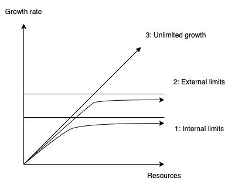
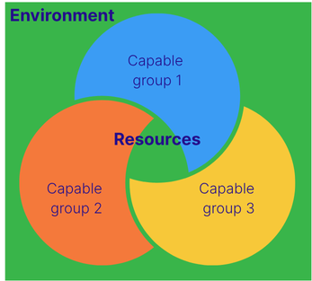

In an unobstructed ideal environment with ideal person, growth is limitless

But, what could be hinders to growth?
1. Internal factors: the inner force that 
* Health (the body)
* Life energy (the heart)
* Framework of thinking (the mind) 

2. External factors
* Resources (money, assets, network, tools, ...)
* Capability to leverage resources (skills, talents, experts, ...)
* Environment that governs resources (community, policies, markets, ...)

Growth comes with (consume, manage, cultivate, ...) more resources. Stronger capability allows more extraction of resources. However, one person extracting more resources means less resources for others due to the limited nature of resources. That nature of overlapping groups of people trying to take resources creates the environment (either competing or sharing), the checks and balances system.

By overcoming these limits, we can achieve higher growth. 
## Analyzing from other thoughts on growth
1. https://www.psychologytoday.com/us/blog/the-power-prime/201201/personal-growth-four-obstacles-positive-life-change
	Growth is about letting go the current way of thinking, and adopting better way of thinking
	Four obstacles: 
	* Baggage (Framework of thinking reinforced through childhood development) 
	* Habits (Framework of thinking reinforced through repetitions)
	* Emotions (Life energy reinforced through past emotions)
	* Environment (The author covers only the community part for reinforcing new way of thinking)

2. https://plato.stanford.edu/entries/capability-approach/
	The capability approach is a theoretical framework that entails two normative claims: first, the claim that the freedom to achieve well-being is of primary moral importance and, second, that well-being should be understood in terms of people’s capabilities and functionings.