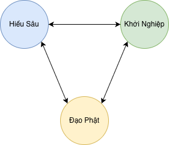

**Đạo Phật là con đường dẫn tới tiến hoá**

## Hội Sáng Tạo
Sáng Tạo là như thế nào? Tạo ra giá trị Sáng có lợi cho cộng đồng.

Giá trị được Tạo phải Sáng, không được Tối. Để như vậy, Người Sáng Tạo phải có sự Hiểu Sâu sắc, coi đó làm điểm tựa để Khởi Nghiệp. Cách thức rèn luyện là Đạo Phật.

Nhóm tập trung vào nghiên cứu và ứng dụng Đạo Phật vào Sáng Tạo.

Nếu bạn thấy tầm nhìn của cộng đồng hay, hãy liên hệ với mình: nghuyenthevinh@gmail.com

## Hiểu Sâu - Nền tảng năng lực

## Khởi Nghiệp - Tạo giá trị

## Đạo Phật - Con đường rèn luyện

