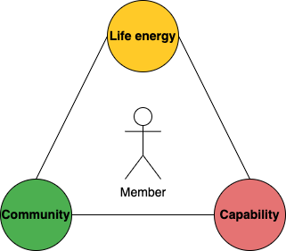
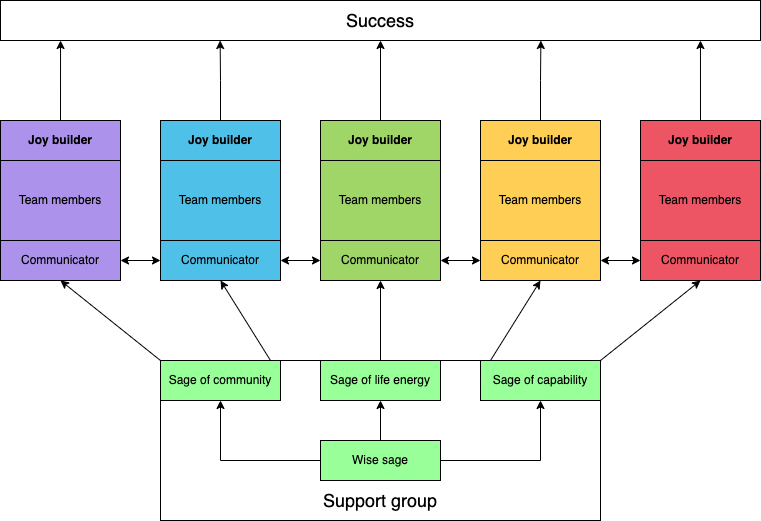

**Buddhism is the vehicle towards infinite innovations**

The Buddha foresaw a path towards end of sufferings, known as The Four Noble Truths. He pointed out The Eightfold Noble Paths as the practice to see the universal root of truths. In simple terms, it shows how we can evolve pass body, heart and mind limits to reach the universal truths. A century of technological innovations has pushed the boundary of human limits beyond our ability to comprehend, resulting in crippling fear. To push innovations even further beyond human limits without fear, Buddhism seems to be the only way.

This group is dedicated to the research and application of Buddhism into innovations and startups.
## JBG - Joy Builder Group
What does it mean to be a builder? A builder is to bring joyful products to the world. Our world becomes a little better thanks to that. This group of builders believes in bringing joyful products to the world!

A builder is first a person. A person goal in life is to be happy, why put conditions on it when you can be happy now. A happy person first, then a builder who can bring happy products to the world. 

The community cultivation trio:
1. The life energy (gas): individuals should seek to cultivate their own life energy
2. The capability (road): individuals should seek to cultivate their own capabilities
3. The community (support): high-energy and capable individuals are the foundations of our community

If you find our community goal interesting, let's us know: nghuyenthevinh@gmail.com
## The life energy - the source of proactive
We do not force people! We cultivate life energy!

Energy is like gas for car. If it is fulfilling, the car can run very fast. If it is exhausting, the car cannot run fast. Forcing for a long time depletes life energy, very unstable engine. Thus, to be proactive, we should cultivate even more life energy instead of forcing. The more life energy, the more proactive!

There are three sources of life energy. These should be **slowly cultivated** over time through proper workloads and enough resting.
1. Body energy: keeps us from sickness, leads to wellness
2. Heart energy: keeps us from psychosis, leads to happiness
3. Mind energy: keeps us from confusion, leads to clearness
## The capability - the source of success
Dreaming of success without inner capabilities is delusional. Which capabilities are needed to be a builder?

There are infinite paths to success, each person has to figure out their own unique paths that they **feel comfortable** with. The three capabilities below are easier said than done as they **reveal deepest fears** within us.

At any time, there will always be several meta mindsets for success. Juniors will copy these meta in hope of achieving the same result not knowing the full requirements to it. However, discovery of these meta builds is also very crucial to shape our own paths. Discovery of self and discovery of others. But, most people fear discovery because of the unknown ahead and choose to stay ignorant. Thus, the first capability is **discovery**. 

As more meta mindsets are being discovered, how can we actually adopt these to shape our own paths? Some meta will improve our paths, some will majorly change our paths. But, most people fear change and choose to cling to their own flawed paths. Accepting changes means accepting that we are flawed, not excellent. Thus, the second capability is **change**.

As we slowly improve our paths, we ponder where the other paths could also lead us to? what weaknesses exist within our own framework of thinking? what helps we need to discover and change? we can never know unless we share ourself to others, and helps others express themselves. Sharing has been the single most vital key to our species survival against all the odds this world throws at us. But, most people fear sharing and choose to hide themselves. Reasons could be many from lack of trust, to fear of judgement. Thus, the third capability is **sharing**.

Our community commits to support members to practice these three capabilities.
## The community - the source of support
One man is vulnerable to all kinds of risks and stress. Having support emotionally and physically lessens one man sufferings, and promotes group happiness. How the community will be organized?

**Trust** is the single most important factor in a strong community. Trust in others capability to make us happy. The community organization must ensure that every members are heard, fairly treated, and supported on their own journey towards success.

This organization structure is heavily influenced by the book: "Reinventing organizations".

1. **Support group**: support group serves the community members
* Wise sage: who has great care for each members in the community and ensures the functioning of the support group
* Sage of community: who ensures the functioning of the community. Can also be considered as Chief Operating Officer (COO)
* Sage of life energy: who supports the cultivation of each community members life energy. Can also be considered as Chief Human Resources Officer (CHRO)
* Sage of capability: who cultivates community member capability through teaching initiatives, and productivity products. Can also be considered as Chief Product Officer (CPO)

2. **Joy builder teams**: the basic self-governing units
* Joy builder: the people leading and building joyful products to serve humanity happiness
* Team members: product vision - aligned team members who wish to contribute
* Communicator: ensures communication among internal team members, and externally with other builder teams and support groups
